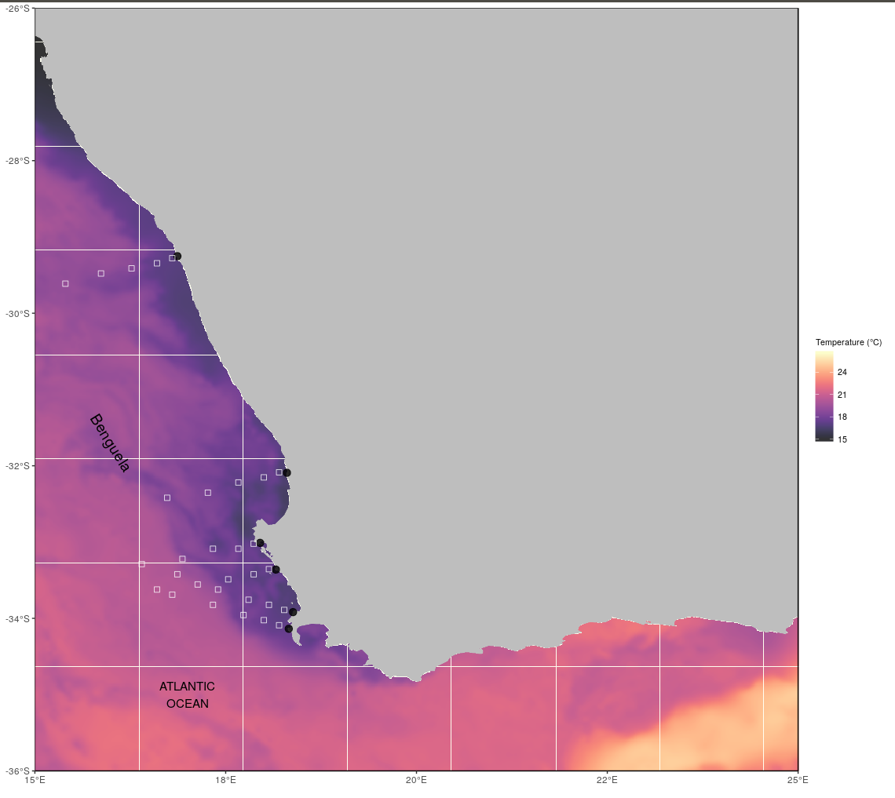

\newpage
## Abstract

The South African coastline is comprised of three distinct coastal regions, each varying in average temperature due to the presence of two distinct ocean currents; namely the Agulhas and Benguela currents, the latter an eastern boundary upwelling system (EBUS). This study was designed to examine whether same upwelling patterns were discernible at varying distances from the coastline and if this was apparent from different datasets. Analyses of temperature time series data from 4 sites within the west coast of South Africa were conducted to examine the variation in intensity occurring in different upwelling events at different distances from the coastline. This study further made use of wind data to determine the upwelling index for each of the sites. By using the ANOVA analyses, it was possible to determine the relationship between intensity for each of the sites at variable distances. Results showed high intensity of upwelling events in the OISST dataset but less high intensities in the CMC dataset. Similar upwelling patterns are present in the in situ and OISST dataset at a distance of 10km from the coastline. However, it should be notes that at distances of 50km or more from the coastline, fewer upwelling events are detected in both remotely sensed datasets.

*Keywords*: Seawater temperature, climate change, coastal regions, code: R, variability, upwelling

\newpage
## Acknowledgments

I would like to thank SAWS, DAFF, DEA, EKZNW and SAEON for the contribution of all the raw data used in this study. Without the collection of this data this article and the South African Coastal Temperature Network (SACTN) would not be possible. This research is funded by a South African National Research Foundation Grant (SFH180604339745). The data and analyses used in this paper may be found at [Add appendix link here]

\newpage
## Introduction

Upwelling is a physical oceanographic process in which cold, nutrient rich waters are pushed to the surface as a result of the motion caused by alongshore equatorial winds. These upwelling events are known to have a large influence on the abundance, diversity, and distribution of marine organisms, and moreover, critically affect marine ecosystem processes. Occurring globally throughout the world's oceans, four major eastern boundary upwelling systems (EBUS) can be recognised; each significantly impacting associated coastal systems. These respective systems are characterized as vast regions of coastal ocean occurring along the western shores of continents bordering the Pacific and Atlantic Oceans [@bakun1990; @pauly; @bakun2015]. There has been significant interest in major upwelling systems since the later 1960s, with major interest occuring off Peru [@walsh] and North-West Africa [@barber]. Research done by Copenhagen 1953, reported a number of sites along the west coast of southern Africa where upwelling was particularly intense. The two sites of intense upwelling activity were found off the Cape Peninsula and off Cape columbine [@copenhagen; @andrews]. Whilst upwelling plays a significant role in ecological processes, climate change largely influences this phenomenon.

Over the past three decades, anthropogenic climate change has established global concern as it has been shown to have negatively affected marine and terrestrial ecosystems [@hoegh]. The consequences of these changes are also shown to have had direct effects on the behaviour and functioning of marine organisms, thus ultimately affecting species trophic levels and integration [@doney]. According to the Bakun hypothesis, an increase in greenhouse gases will result in an increase in day-time warming and night-time cooling and ultimately cause an increase in temperature gradients which will then form stronger pressure gradients [@bakun1990]. Pressure gradients are known to affect wind patterns which will subsequently affect the intensity and duration of upwelling events [@hsieh; @mote; @lima]. Over the last few decades, climate change has resulted in drastic pressure and temperature gradients. 

Several studies have provided significant evidence suggesting that there has been an increase in ocean surface temperatures over the last few decades [@vose2012noaa]. These temperatures have increased as a result of anthropogenically driven climate change [@gruber]. Warming is shown to slowly move down into the water column thus increasing thermal stratification [@chhak; @jacox2011]. This thermal stratification restricts the depth at which water is upwelled and therfore limits the amount of nutrients brought up to the surface with a decrease in oxygen and pH levels [@chhak; @jacox2011; @jacox2016]. Climate change impacting oceanic processes has major ecological consequences [@walther]. This is demonstrated in several regions increases in sea surface temperatures have been proven to greatly influence marine species survival, reproduction and abundance. Climate change has also been shown to largely influence coastal species such as corals, muscles and oysters [@hoegh]. Given the importance of primary production, it was determined that the Benguela upwelling system, the eastern boundary upwelling system in South Africa, should be the focus of this paper. Furthermore, it should be understood that increases in sea surface temperatures bear considerable economic impacts as well [@murawski1993; @murawski2000] therefore understanding the impact and cause of climate change has merit not only in mitigation efforts in limiting environmental degradation and maintaining ecosystem functioning, but in its negative affects to local and broader economies as well as human populations dependent on these coastal regions. 

The 3000km South African coastline is bordered by the Agulhas current along the east coast and the Benguela current (an EBUS) along the west coast. These coastal regions display noticeable differences in seawater temperatures primarily due to the influences of the neighbouring ocean currents [@mead; @schlegel2016; @schlegel]. The Benguela Current is driven by the anticyclone high pressure systems and eastward moving cyclones which determine the boundaries of the Benguela upwelling region [@jarre; @hutchings]. The atmospheric temperatures along the coastline are largely influenced by the Benguela Current [@van], however, upwelling systems may be forced by various atmospheric conditions [@lutjeharms1987; @lutjeharms2003; @roberts; @hutchings]. Regionally, the Benguela Current assists in transporting cold water northwards from the Southern Ocean to the coast [@luning1990; @lutjeharms2000; @hutchings; @schlegel].

The Benguela system is bounded by the equatorward and poleward ends by warm water regimes. These currents are known to be forced by local wind stress fields off southwest Africa [@nelson; @fennel]. This particular EBUS stretches along the south-western coast of Africa, from southern Angola to Cape Agulhas [@cole], with water temperatures coldest and most persistent off the Namibian coast at 25°S and weakest at 17°S [@lutjeharms2000]. The upwelling period in the Benguela north of 25°C persists throughout the entire year but peaks during August. The Benguela upwelling region is split into northern and southern systems by a zone of intense perennial upwelling activity in the Luderitz region in Namibia [@shannon1984; @shannon1986; @cole]. Several studies have shown that extreme warming and cooling periods occur in the northern and southern Benguela systems [@stander; @walker; @shannon1984; @boyd; @brainard]. Furthermore, Walter (1937) found that warm periods of global ocean temperatures may have resulted as a lack of upwelling or poor upwelling events. During the periods of warming, the equatorward wind stress over the northern region of the Benguela system was stronger than usual yet upwelling was suppressed by the southward movement of warm saline waters from the Angolan region. In the southern Benguela region, continental shelf bathymetry and strong upwelling favourable winds are known to result in more intense upwelling events. Upwelling occurring along the southern coastline of southern Africa are usually generated by local winds. 

The Cape peninsula is influenced by south-east trade winds during summer and westerlies during winter, thus a pronounced seasonal cycle is evident within patterns of wind movement across the coastline. During spring, summer, and autumn seasons, the anticyclonic high-pressure cell periodically ridges eastwards south of the continent [@preston1977towards; @bakun1990]. During this process, south easterly winds predominate, with peak frequencies occurring during spring and summer months resulting in more upwelling events during summer and winter months [@bakun1990; bakun2015]. During the winter seasons, low pressure cells are driven from the west to the east as a result of the atmospheric circumpolar waves and so north-westerly winds dominate during winter. South easterly winds dominate during summer but are still present for short durations during winter [@andrews]. Within a range of kilometres off the shore, wind conditions vary due to the effects of mountain funnelling within the region [@andrews] and as a result conditions are variable in the nearshore and offshore. 

The dynamics of upwelling within the nearshore (<400m from the coastline) remains poorly understood, with Very few studies addressing the changes in the intensity of cold events at varying distances from the coast within the Benguela region. Cold temperatures are important in describing species population distribution limits and are proven to set limits in the north or southwards higher latitudes (Firth et al., 2011). Upwelling metrics are often calculated far offshore because measurements are typically taken from large ships that cannot move close to the shore [@andrews]. There has not yet been any understanding of how the upwelling process varies at local versus broader scales. Within this study it is hypothesized that the upwelling metric may vary spatially across different distances, with more intense upwelling events occurring nearest to the coast.

Strong temperature gradients existing between offshore and inshore oceanic waters may result in different upwelling event readings. Upwelling relatively close to the shore has been found to depend on the strength and direction of the wind and tend to vary based on seasonal wind variation [@andrews]. Inshore temperatures tend to be lower during summer months due to upwelling, but there is an increase in offshore temperatures in the later summer months as a result of warming of the South East Atlantic Surface waters [@andrews; @shannon1984]. Due to the temperature gradients that exist inshore and offshore, this study focused on observing upwelling patterns from the coastal region to 50km from the coastline.

The central assumption of this project was that remotely-sensed SST data and *in situ* seawater temperature data may be compared. Remotely sensed SST data and *in situ* seawater temperature data were obtained at different resolutions and so slight changes may be found within the different datasets. The primary aim of the first study was to make use of various remotely sensed SST and *in-situ* collected coastal seawater temperature data. The most appropriate dataset for the measurement of the nearshore temperatures within South Africa was the South African Coastal Temperature Network (SACTN) dataset [@smit2013]. It was useful to examine whether or not the same upwelling patterns exist at different distances from the coastline and if these patterns that exist are evident within the various datasets. This investigation examined recent trends and variation of upwelling events at different distances from the coastline.

## Methods

### Temperature data

The South African Coastal Temperature Network (SACTN) data served as the *in situ* temperature dataset used in this study. This dataset consists of coastal seawater temperatures obtained from 129 sites along the South African coastline. This dataset consisted of coastal seawater temperatures for 129 sites along the coast of South Africa, measured daily from 1972 until 2017, with contributions made from several organisations and governmental departments. Of these, 80 were measured using hand-held thermometers and the remaining 45 were measured using UTRs. The duration and extent of the recordings per site were uneven, with the longest time series in the dataset being that of Gordons Bay. Data collected for this region started on 13 September 1972 and concluded on 26 January 2017, with recordings still continuing daily. During the 1970s, a total of 11 time series began recording. A further 53 entries were added during the 1980s, 34 entries were added during the 1990s, and 18 entries were added during the 2000s. Recordings are still ongoing at many of these sites. For this analysis, the data were combined and formatted into standardized comma delineated values (CSV) files which allowed for a fixed methodology to be used across the entire dataset. Prior to data analysis, all data points exceeding 35°C and/or below 0°C were removed as these were considered as outliers. These data points were then changed to NA (not available) so as to not interfere with analysis. Recordings are still ongoing at many of these sites.

Additionally this study has sought to incorporate remotely sensed temperature datasets; complied by a number of organisations across the globe, each specialising in remotely sensed SST data and information products; utilising satellites to provide a system of large spatial and temporal data retrieval. The AVHRR-only Optimally-Interpolated Sea Surface Temperature (OISST) was used to determine SST within the study region. The AVHRR datasets have been providing global SSTs for more than four decades [@reynolds]. OISST is a global 1/4° gridded daily SST product that assimilates both remotely sensed and *in situ* sources of data to create a level-4 gap free product [@banzon]. The CMC dataset constitutes the second dataset and is a version 3.0 Group for High Resolution Sea Surface Temperature (GHRSST) Level 4 dataset with a 10km resolution constructed by the Canadian Meteorological Center (CMC). The CMC dataset combines infrared satellite SST at numerous points in the time series from the AVHRR, the European Meteorological Operational-A (METOP-A) and Operational-B (METOP-B) platforms, and microwave SST data from the Advanced Microwave Scanning Radiometer 2 in conjunction with in situ observations of SST from ships and buoys from the ICOADS program (PO.DAAC, https://podaac.jpl.nasa.gov/). 

An advantage of using of *in situ* data over satellite data is that they provide a more accurate representation of the thermal properties closer to the coast where satellite temperatures do not capture temperature properties well and can therefore more accurately explain upwelling within the coastal inshore environment. Smit et al (2013) have shown that satellite data collected along the South African coastline represent a warm bias reaching as high as 6°C over *in situ* temperatures within the nearshore environment.

In order to create a time series of each of the remotely sensed SST data and also to compare whether the same upwelling patterns exist on the broad-scale against the *in situ* time series, shore-normal transects were extended from the *in situ* sites along the west coast of South Africa. Temperature values from the various satellite datasets were extracted at 15, 25, and 50 km along the shore-normal transect from the coast shown as black boxes in Fig. 1. The daily SST values obtained from the various remotely sensed datasets along each of the transects were used to produce an offshore time series that could accurately be used as a dataset to be compared against the *in situ* time series. Offshore transects were used in order to generate a time series in this manner as they accurately represent the mesoscale temperatures we were interested in comparing against coastal upwelling. Had we only made use of the nearest remotely sensed pixels to compare against the SACTN time series this would simply only draw a comparison between datasets, and not the mesoscape acitivity within the ocean. 

### Wind data

The wind was an important variable in this study as it was hypothesised that wind direction and wind speed may have a direct influence on upwelling, consequently, the wind was investigated for its impact on upwelling at specific sites along the west coast of South Africa. Wind data were obtained from the South African Weather Service (SAWS), and were provided at a three-hour temporal resolution. The wind variables used here were wind direction (dirw) and wind speed (spw). Since the wind data were modelled at three-hour resolutions, they were converted into daily data points in order to compare them with the temperature data. The `circular()` function in R software [@team] was used to create circular objects around the wave data in order to calculate the daily wind parameters. ERA5 hourly data on pressure levels were used as a second wind source To visualize a synoptic view of the wind state around the Benguela region during coastal upwelling, we chose to use ERA-5 to provide wind vectors (10m above surface). ERA-5 is a fifth generation atmospheric reanalysis of global climate product produced by the European Center for Medium-Range Weather Forecasts (ECMWF, http://www.ecmwf.int/) [@molten]. ERA-5 is a comprehensive global model that assimilates a wide range of data to create a short term forecast. At the time of this writing the chosen variables were available for download from January 1st, 1979 to December 31st, 2016. The data used in this study were downloaded at a daily resolution on a 0.25° grid and within the latitude/longitude of the study region (Fig 1). With temperature and wind values now corresponding, we tested if upwelling pattersns varied at different distances from the coastline.

### Site selection

The South African coastline exhibits a large variation in seawater temperature and is divided into four bioregions [@smit2013, @mead]. The western region of the coastline is dominated by the Benguela Current forming an Eastern Boundry Upwelling System (EBUS) [@hutchings], which provides a natural laboratory for this study. Annual mean coastal seawater temperatures within this region have a range of 12.3 ± 1.2°C at the Western limit near the Namibian border. Seasonal upwelling is controlled by south-easterly trade winds and as a result reflects distinct temperature variations representing much lower temperatures within the upwelling cells over a fairly narrow continental shelf found from the Cape Peninsula to Cape Columbine. In order to accurately examine upwelling patterns at various distances from the coast, several sites from the SACTN dataset along the west coast of South Africa (i.e. sites influenced by the Benguela current) were selected. Since temperature data were not evenly recorded for each of the sites, the entire dataset was narrowed to only those sites with a time series of longer than 30 years. This yielded a total of four sites within the Benguela region (Fig 1).

```{r , echo= FALSE, message=FALSE, warning=FALSE, fig.cap="Map representing the study region along the South African coastline. The black points represent the location of their *in situ* temperatures and approximations of the pixels used along the shore normal trasect from the satellite sea surface temperatures shown with black boxes", fig.height=8, fig.width=12, fig.pos="H"}


```

### Defining and determining upwelling

In order to determine the change in upwelling signals at various different distances from the coastline, and to test which dataset showed a clear, and visible representation of these events, it was first necessary to define when upwelling was occurring; however to accomplish this it was first required to establish a threshold value for identifying when the phenomenon was in taking place. Given that upwelling is primarily caused by alongshore, equatorward winds, it was necessary to consider both temperature and wind values. These data values are instrumental in determining the specific environmental conditions and parameters required for upwelling to occur; to accomplish this an upwelling index was calculated using the formula presented in the work by Fielding and Davis (1989):

                  $$ UpwellingIndex = μ{(Cosθ − coastal angle)} $$
                  
In this equation, μ represents the wind speed (m/s) and θ represents the wind direction, which is measured in degrees, and the coastal angle as the angle of each of the sites perpendicular to the coastline. The index relies heavily on wind speed and direction data in order to determine the intensity of upwelling and the likelihood of the phenomenon occurring. The above equation produces a value called the upwelling index; for this study specifically, upwelling was classified to occur when the index value is greater than 1. However to further ascertain a threshold for upwelling, the `exceedance()` function within the _`heatwaveR`_ package [@schlegel2017heat] was utilised, specifically to determine the consecutive number of days that the event must exceed for it to be regarded and classified as an upwelling event. However it should be noted that upwelling is known to vary on a seasonal basis and also may occur hourly. Therefore this study sought to establish the minimum duration for the analyses of upwelling as 1 day; the rationale behind this being that data from the SACTN dataset as well as the satellite remotely sensed SST data is collected daily. Furthermore, it was also decided to make use of a percentile value rather than a static upwelling index value of >1 as percentile values are often more approved. It was then determined that a 25th percentile threshold for the upwelling index result lasting for >= 1 days matched with the upwelling index value of >1. As a result the 25th percentile threshold was used as a more acceptable value to predict upwelling events. In order to determine the upwelling metrics, the `detect_event()` function within the _`heatwaveR`_ package was used.An R script (https://github.com/AmierohAbrahams/Upwelling_MCS) was used to calculate the individual upwelling events for both the *in situ* and remotely sensed SST data. Because upwelling events were calculated relative to percentile exceedances, rather than an absolute definition such as periods with temperatures above a fixed temperature threshold, upwelling events occurred any time of the year with upwelling shown to be more dominant during spring and summer months. It must also be stated that due to irregular sampling efforts in the SACTN dataset the spatial and temporal distributions of upwelling is not necessarily even. 

## Statistical analyses

A series of ANOVA tests were used to compare the main effects of the chosen variables on a continuous variable. In this analysis the relationship between sites based on the mean intenisity of upwelling as a function of distance and duration were analysed; these analyses tested if significant differences occurred between upwelling at different sites and distances from the coastline within each of the various datasets.

## Results

```{r  echo= FALSE, message=FALSE, warning=FALSE, fig.cap="Timeline of several event metrics. This graph shows the duration of events on the y-axis and the time variable on the x-axis for Sea Point and Saldanha Bay using the OISST dataset. The number of top events from the chosen metric may be highlighted in a brighter colour.", fig.height=8, fig.width=12, fig.pos="H"}

knitr::include_graphics("../Figures/OISST_1.pdf")
```

```{r  echo= FALSE, message=FALSE, warning=FALSE, fig.cap="Timeline of several event metrics. This graph shows the duration of events on the y-axis and the time variable on the x-axis for Port Nolloth and Lamberts Bay using the OISST dataset. The number of top events from the chosen metric may be highlighted in a brighter colour.", fig.height=8, fig.width=12, fig.pos="H"}

knitr::include_graphics("../Figures/OISST_2.pdf")
```

Sea Point showcased the most intense upwelling event at 10 km from the coastline during the year 2013, lasting for 21 days (Fig 2). The majority of upwelling events in Sea Pont occurred around 10 km away from the coastline lasted for less than five days, and had an approximate cumulative intensity ranging between of -10.00deg. C x days and 12.00 deg. C x days. Conversely, at shorter distances like 30 km from the coastline several upwelling events lasted for longer than 15 days with a cumulative intensity ranging between -30deg. C x days and -20deg. C x days. At a distance of 30 km both dominant events appear at a distance of 10 km are present along with several other additional events (This doesn’t make sense). At a distance of 40 km, less intense events occurred. At a distance of 50000 km from the coastline, several events appear to have lasted for approximately 2 – 3 days with the most intense events still occurring in 2015.Events within Saldanha Bay typically lasted for approximately three days but varying at different distances. At a distance of 10 km one major event occurred that lasted for approximately 27 days with a cumulative intensity of -61.70deg. C x days. This event was also present at a distance of 20 km from the coastline, albeit at a lesser intensity, but was not present at 30km, 40km and 50km respectively. Events occurring within 30 km and 40 km from the coastline lasting for approximately 10 days in most cases. However, the majority of events were observed at a distance of 10 km and 20 km from the coastline. Fewer events occurred at a distance of 50 km, with most of the events occurring at this distance having lasted for less than five days.

Throughout Port Nolloth (Fig 3), most of the events detected lasted less than five days. At a distance of 10000 km one obvious major event occurred during 2016 which had a cumulative intensity of -43.39deg. C x days. This event persisted at 20 km and 30000 km with cumulative intensities of -21.09deg. C x days and -14.33 deg. C x days respectively. Here, most upwelling events were detected at 10km and 20km respectively. The least number of events were detected at 50 km. The least intense upwelling event lasted for only 3 days and had a cumulative intensity of -5.45deg. C x days during the year 2010.

Events occurring within Lamberts Bay (Fig 3) lasted for approximately less than five days. Three major events were detected at 10 km and 20 km away from the coastline respectively. At 30 km an event with a longer duration occurs in 2010, that was not present at a distance of 10 km and 20 km from the coastline. At a distance of 40 km no major events were detected. However, at a distance of 50 km a major upwelling event is detected lasting for longer than 20 days. Fewer events were however detected at a distance of 50 km from the coastline.

```{r  echo= FALSE, message=FALSE, warning=FALSE, fig.cap="Timeline of several event metrics. This graph shows the duration of events on the y-axis and the time variable on the x-axis for the SACTN dataset. The number of top events from the chosen metric may be highlighted in a brighter colour.", fig.height=8, fig.width=12, fig.pos="H"}

knitr::include_graphics("../Figures/SACTN.pdf")
```

Within the SACTN dataset (Fig 4), the majority of upwelling events detected in Lamberts Bay lasted for longer than five days. The longest upwelling event was detected in 2012 lasting for approximately 12 days with a cumulative intensity of -12.63deg. C x days. Several upwelling events were detected at this site. Only eight upwelling events were recorded and detected at Port Nolloth. Here most of the lasted between three to five days with the most intense event lasting for 11 days with a cumulative intensity of -12.81deg. C x days. Saldanha Bay upwelling events also lasted between three to five days. The event with the longest duration occurred in 2016 with a cumulative intensity of -22.58deg. C x days. Events observed within Sea Point lasted less than five days, but two events lasted for 21 days. Those events represented intensities of -54.54 and -36.81 deg. C x days respectively.

```{r  echo= FALSE, message=FALSE, warning=FALSE, fig.cap="Timeline of several event metrics. This graph shows the duration of events on the y-axis and the time variable on the x-axis for Sea Point and Saldanha Bay using the CMC dataset. The number of top events from the chosen metric may be highlighted in a brighter colour.", fig.height=8, fig.width=12, fig.pos="H"}

knitr::include_graphics("../Figures/CMC_1.pdf")
```

```{r  echo= FALSE, message=FALSE, warning=FALSE, fig.cap="Timeline of several event metrics. This graph shows the duration of events on the y-axis and the time variable on the x-axis for Port Nolloth and Lamberts Bay using the CMC dataset. The number of top events from the chosen metric may be highlighted in a brighter colour.", fig.height=8, fig.width=12, fig.pos="H"}

knitr::include_graphics("../Figures/CMC_2.pdf")
```

CMC observations of upwelling events (Fig 5) at Sea Point detected durations of less than four days. The most intense event occurred in 2010, and I found that intensifies appeared to increase with distance from the coastline. The fewest number of events occurred 50 km away from the coastline. At Saldanha Bay, the duration of upwelling events mostly ranged between three to four days. Similar intensity patterns occurred at 10 km, 20 km and 30km from the coastline respectively. At 40 km an event representing a cumulative intensity of -28.64deg. C x days for was detected for 20 days within 2010. At Port Nolloth (Fig 6), most of the events are found to occur for duration of three days. Two major upwelling events were present at different distances within 2010 with a variation in their respective cumulative intensities. Those events both lasted for approximately seven days. Similar patterns were found within Lamberts Bay (Fig 6). At 30 km a major event was detected that lasted for approximately 19 days, but most events here lasted for less than five days. At a distance of 40 km and 50 km from the coastline similar patterns were observed, with most events being detected at 40 km and 50 km respectively.

<!-- \def\tiny{\@setfontsize\tiny{10pt}{11pt}} -->
\begin{tiny}
\begin{center}
\setlength\tabcolsep{3pt}
\begin{longtable}{|r|r|p{2cm}|}
\caption{The cumulative intensity (°C x days) for the sites located within the Benguela upwelling system using the OISST dataset. The site column gives the name of the site. The distance column gives the distance from the coastline as seen in Fig 1.} \\

% This is the header for the first page of the table...
\toprule
Site & distance & regression slope  \\
\midrule
\endfirsthead

% This is the header for the second page of the table...
\toprule
Site & distance (km) & regression slope  \\
\midrule
\endhead

% This is the footer for all pages except the last page of the table...
\midrule
\multicolumn{5}{l}{{Continued on Next Page\ldots}} \\
\endfoot

% This is the footer for the last page of the table...
\bottomrule
\endlastfoot

% Now the data...

Lamberts Bay & 10 & -1.83 \\
Lamberts Bay & 20 & -1.83 \\
Lamberts Bay & 30 & -1.83 \\
Lamberts Bay & 40 & -0.73 \\
Lamberts Bay & 50 & 0.73 \\
Port Nolloth & 10 & -1.10 \\
Port Nolloth & 20 & -0.37 \\
Port Nolloth & 30 & 0.00 \\
Port Nolloth & 40 & 0.37 \\
Port Nolloth & 50 & 0.37 \\
Saldanha Bay & 10 & -2.19 \\
Saldanha Bay & 20 & -1.83 \\
Saldanha Bay & 30 & -0.73 \\
Saldanha Bay & 40 & 0.73 \\
Saldanha Bay & 50 & 1.10\\
Sea Point & 10 & -2.56 \\
Sea Point & 20 & -3.29 \\
Sea Point & 30 & -2.56 \\
Sea Point & 40 & 0.00\\
Sea Point & 50 & 1.46 \\

\end{longtable}
\end{center}
\end{tiny}

<!-- \def\tiny{\@setfontsize\tiny{10pt}{11pt}} -->
\begin{tiny}
\begin{center}
\setlength\tabcolsep{3pt}
\begin{longtable}{|r|r|p{2cm}|}
\caption{The cumulative intensity (°C xday) for the sites located within the Benguela upwelling system using the CMC dataset. The site column gives the name of the site. The distance column gives the distance from the coastline as seen in Fig 1.} \\

% This is the header for the first page of the table...
\toprule
Site & distance & regression slope  \\
\midrule
\endfirsthead

% This is the header for the second page of the table...
\toprule
Site & distance & regression slope  \\
\midrule
\endhead

% This is the footer for all pages except the last page of the table...
\midrule
\multicolumn{5}{l}{{Continued on Next Page\ldots}} \\
\endfoot

% This is the footer for the last page of the table...
\bottomrule
\endlastfoot

% Now the data...

Lamberts Bay & 10 & 3.29 \\
Lamberts Bay & 20 & 2.92 \\
Lamberts Bay & 30 & 2.92 \\
Lamberts Bay & 40 & 2.56 \\
Lamberts Bay & 50 & 1.83 \\
Port Nolloth & 10 & 2.56 \\
Port Nolloth & 20 & 2.56 \\
Port Nolloth & 30 & 1.46 \\
Port Nolloth & 40 & 1.10 \\
Port Nolloth & 50 & 1.10 \\
Saldanha Bay & 10 & 3.29 \\
Saldanha Bay & 20 & 4.38 \\
Saldanha Bay & 30 & 4.02 \\
Saldanha Bay & 40 & 2.92 \\
Saldanha Bay & 50 & 2.92\\
Sea Point & 10 & 3.29 \\
Sea Point & 20 & 3.65 \\
Sea Point & 30 & 4.02 \\
Sea Point & 40 & 3.29 \\
Sea Point & 50 & 2.19 \\

\end{longtable}
\end{center}
\end{tiny}

<!-- \def\tiny{\@setfontsize\tiny{10pt}{11pt}} -->
\begin{tiny}
\begin{center}
\setlength\tabcolsep{3pt}
\begin{longtable}{|r|r|p{2cm}|}
\caption{The cumulative intensity (°C x day) for the sites located within the Benguela upwelling system using the SACTN dataset. The site column gives the name of the site. Tempertures were collected at the coastline and not at different distances from the coastline.} \\

% This is the header for the first page of the table...
\toprule
Site & distance & regression slope  \\
\midrule
\endfirsthead

% This is the header for the second page of the table...
\toprule
Site & distance & slope  \\
\midrule
\endhead

% This is the footer for all pages except the last page of the table...
\midrule
\multicolumn{5}{l}{{Continued on Next Page\ldots}} \\
\endfoot

% This is the footer for the last page of the table...
\bottomrule
\endlastfoot

% Now the data...

Lamberts Bay & 1.10 \\
Port Nolloth & 1.10 \\
Saldanha Bay & 0.37 \\
Sea Point & 1.10 \\

\end{longtable}
\end{center}
\end{tiny}

# Wind rose diagrams

```{r , echo= FALSE, message=FALSE, warning=FALSE, fig.cap="Wind rose diagram representing the most predominant wind direction for each of the sites. Each spoke is divided by colour into wind speed ranges. The radial length of each spoke around the circle is the time that the wind comes from that direction", fig.height=8, fig.width=12, fig.pos="H"}

knitr::include_graphics("../Figures/wind_roses.pdf")

```

Wind diagrams help visualise the patterns present at a particular site. Moving outward on the radial scale, the frequency associated with wind and waves coming from a particular direction increases. The predominant wind direction at Port Nolloth is 135o and at Sea Point it is 315o. Sea Point and Port Nollowth shows the fastest wind speed at a direction of 135o. The predominant wind direction for Lamberts Bay and Saldanha Bay occured at 195o, with the highest wind speed also found within this direction.

# Average intensity between sites at the various distances

Sites compared within the OISST datasets showed no difference in the durations of the events at different distances for each of the sites from the coastline. However, there is a difference in the mean intensity of events between sites (*F*=5.74, *SS*=5.20, *p*<0.001). Additionally, there were also significant differences between the mean intensities of events at different distances from the coastline (*F*=260.17, *SS*=78.60, *p*<0.001), and between the durations in events (*F*=51.39, *SS*= 15.53, *p*<0.001) and between sites. Similar comparisons using the CMC dataset showed that there was no significant difference in the duration of events at different distances from the coastline for each of the sites (Three-Way ANOVA: *F*=1.20, *SS*=0.41, *p*>0.05). However, there were significant differences in the mean intensities of events at different distances (*F*=471.63, *SS*=162.00, *p*<0.05), between the durations of events (*F*= 38.36, *SS*=13.20, *p*<0.001), and between sites (*F*=17.64, *SS*=18.20, *p*<0.002). I also found that there was no significant difference between the durations of upwelling across all sites (*F*=0.22, *SS*=0.20, *p*<0.87). When looking at the in situ collected dataset, data collected at the coastline, we find no difference in the durations of events at across sites (*F*=2.05, *SS*=1.84, *p*=0.11) but there was a difference in the mean intensities of those events (*F*=2.05, *SS*=0.61, *p*=0.44).

## Discussion

This study aimed to investigate patterns occurring within upwelling events at various different spatial intervals from the coastline, as well as to test whether the same patterns are discernible in the various datasets. As seawater temperature is known to have a large influence on species distribution and productivity [@bolton2010; @smit2013], thus it is important to understand not only how temperatures vary at different distances from the coastline but what contributing factors to ecosystem maintenance the intensity of these events have across these distance intervals from the coastline. Of particular interest to this study; the Benguela upwelling system, which is distinct in that it is one of four most productive regions in the world.

In this way, the proximal causes of environmental change might be understood in terms of its relevance in affecting these important regions. Sinnett and Feddesen (2014) expanded on this concept and illustrated that various environmental factors such as solar radiation, air temperature, humidity and wave energy are responsible for temperature variation within coastal regions. Here, however, we examine if the same upwelling patterns exist between the local and broader-scale SST fields given that various factors influence temperatures at different scales.

Results gathered during the course of this study clearly illustrate that upwelling events detected in different ocean sea surface temperature datasets showed variations with regards to duration and intensities across different distances. Noticeably, some patterns were dominant and persistent throughout the datasets; however, it was also observed that fewer upwelling events occurred at distances furthest away from the coastline. This was correlated in satellite datasets, where, often at distances of 10km and 20km from the coastline, similar upwelling events were apparent. This difference appears to be related to nature and the variability of physical oceanographic processes at both the broader and local scales; however, the potential involvement of other processes cannot be ruled out. These findings illustrate how dis-similar satellite data is from in situ collected datasets.

Often the differences noted between the in situ and satellite derived data were striking. Initially, it was anticipated a large degree of coupling within the datasets across the local and broader scales would be observed; instead the OISST satellite derived data yielded a more intense representation of events as compared to the SACTN collected data. The CMC dataset showed that events were moderate throughout the various sites and matched more closely with the in situ data observed. Information of events obtained from the OISST satellite data illustrated that these phenomena occurred more frequently and for longer durations.

Furthermore, it is now believed that the larger intensities witnessed within the in situ dataset may be in actuality an artefact of the inability of remotely sensed data to record the maximum and minimum temperatures that in situ instruments are capable of detecting (Smale and Wernberg, 2009). The in situ collected data shows very few events detected at Port Nolloth, similarly, the CMC and OISST dataset also shows fewer upwelling events recorded at a distance of 10km within this region. Upwelling events recorded in Sea Point match closely with the events detected in the OISST dataset at a distance of 10km. 

Notably the CMC dataset showed large degrees of variance within detected events, however no major events were recorded. It is observed that the SACTN in situ collected temperature data shows similar patterns to the OISST dataset at a distance of 10km; with Saldanha Bay showing the highest frequency in upwelling events detected throughout the datasets. However, the in situ and OISST dataset at a distance of 10km once again showing similar detections as those recorded by the CMC dataset at the same distance from the coastline, and thus does not accurately represent these detected events.  At a distance of 30km – 50km the in situ detected events differed greatly as those compared to what was observed within the satellite derived temperature data.

It should be noted that previous, similar studies have suggested that a longer, sampling time series, comprising of more data would have resulted in greater accuracy with regards to detecting subtle changes in temperature differences obtained from variable coastal regions such as the South African coastline. Schlegel and Smit (2016) suggested that having a time series of greater than 30 years for sites with a low variance results in increased ability to more accurately detect changes. They showed that high quality time series datasets have frequent measurements, with minimal missing (NA) values present. Furthermore, low quality datasets (i.e. those with more than 5% of NA values) have a higher chance of detecting variation where none exists.

We would be amiss to point out some weaknesses inherent in the SACTN dataset. Temperature measurement along the South African coastline started in the 1970s, and has been inconsistent in terms of the instruments used, the modifications to styles and methods, calibration, as well as site locations themselves [@smit2013; @schlegel2016]. Additionally, older records within some datasets, such as the SACTN dataset, may have been lost or are unreliable since the metadata for these are no longer available. These metadata are essential as their absence prevents the understanding of the influence regarding the utilised instruments on temperature recordings. It can thus be speculated that some measurements may not accurately represent well-validated temperature data due to the instrumentation used; however, we mitigated these effects by selecting only the most reliable and longest duration data, which other current and on-going studies, such as that by Williamson et al. have suggested are most suitable for the problem at hand.

Data in the SACTN are compiled from multiple sources, in addition to being acquired by various means, thus creating considerable heterogeneity; however, efforts are currently underway to homogenise these datasets (Williamson et al., in progress). The underwater temperature recorders (UTRs) used to collect data in the SACTN dataset expressed a lower number of NA values as compared to the data collected with hand thermometers. As such, this may have influenced the overall time series dataset [@schlegel2016]. The level of precision at which data were collected also influenced the length of the time series needed. Time series in which temperature is collected at a precision of 0.5°C may require another 24 months of recordings to precisely detect long term variation [@schlegel2016]. The average length of the thermometer time series component of the SACTN dataset was 346 months whereas the average length of UTR time series was less than half of that. With the extent of these differences in length being so severe, even once correcting for potential negative effects on the measurement precision of the thermometer collected time series, it was clear that thermometer data were more useful than that of UTRs. These influences may be expected to affect trend estimates of change derived from the data, however it is not anticipated that they have affected estimates of the variability in time and between sites in the way that they were used in this current study.

Irrespective, satellite-acquired SST records are useful to modern marine scientists. These data are often used to model and predict a wide range of oceanic and biological processes within open ocean ecosystems and habitats; however, these have only recently been used to study temperature variations influencing benthic organisms (Pearce, Faskel, and Hyndes, 2006). SST data acquired by satellites deviate from coastal in situ collected seawater temperatures for a variety of reasons [@smit2013]. The SST data presented the broader-scale situation along the coast, therefore utilised here as a forcing boundary hypothesised here as influencing coastal temperatures. Analysis shows that the offshore SSTs (various sources) at a distance between 30km and 50km often do not match the detected events present within the in situ dataset along the west coast of South African.

EBUS, such at the Benguela upwelling system are known to be highly variable across a wide spectrum of spatial and temporal scales, in both the forcing and response of the system. In some cases, a climate event can force large, although temporary changes in the overall productivity and/or community composition; these effects were seen during the large 1997-98 El Niño event and the delayed upwelling in 2005 in the California Current. EBUS are therefore be characterized as both resilient (quick recovery from disturbances) and robust (maintenance of ecosystem function and relatively high productivity) to natural climate variability, maintaining an abundance of species of high commercial and conservation value. However, the scale of future responses to anthropogenic climate change may be beyond the historical scales of variability, thus making forecasting the response of EBUS to climate change difficult.

The importance of understanding the contributions of variation of upwelling on a local and broad scale relate to how productive these regions are but also indicated that upwelling found at a distance of 50km does not imply that the same upwelling events are present within the nearshore. Thus in order to detect coastal upwelling it is better to make use of coastal data. Within marine environments, coastal temperature variation allows for a varied spectrum in the spatial arrangements of marine biodiversity. Whilst wind and wave action may not be directly affecting ocean temperatures, Blamey and Branch (2009) have found that wave action has a profound influence on species distributions along the coastline. The presence or absence of marine species are determined by a variety of factors and whilst those factors may not be influencing each other as was the case here, they do however, collectively play an important role in affecting the marine life of the South African coastline; therefore, identifying those roles can aid in improving our understanding of nearshore dynamics, thereby providing greater knowledge base to be used for conservation efforts.


