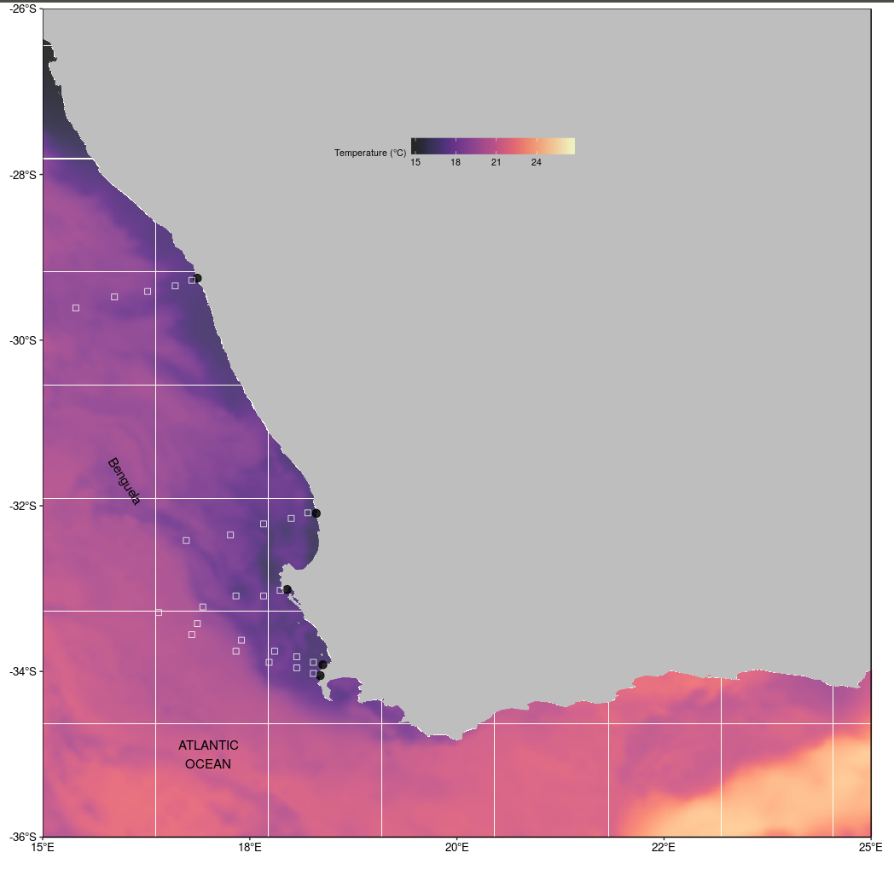

# Paper 1
## Chapter 2 Upwelling

## Abstract


## Introduction

Upwelling is a physical oceanographic process in which cold, nutrient rich waters are pushed to the surface as a result of the motion caused by alongshore equatorial winds. These upwelling events are known to have a large influence on the abundance, diversity, and distribution of marine organisms, and moreover, critically affect marine ecosystem processes (Add in references). Occurring globally throughout the world's oceans, four major eastern boundary upwelling systems (EBUS) can be recognised; each significantly impacting associated coastal systems. These respective systems are characterized as vast regions of coastal ocean occurring along the western shores of continents bordering the Pacific and Atlantic Oceans [@bakun; @pauly]. The inshore waters off the west coast of South Africa are dominated by an upwelling system which, along with the Peru, California and Humboldt currents as Eastern boundary upwelling regions [@andrews] (RWS: This could be made more clear. What is the main point you want to communicate in this sentence?). Eastern boundary upwelling regions only cover 1% of the world’s ocean surface but are among the most productive regions of the world. As such, there has been a constant interest in upwelling systems. Major upwelling programs (RWS: This is too vague. What are these programs?) have already been carried out in Peru [@walsh] and North-West Africa [@barber].

Over the past three decades, anthropogenic climate change has established global concern as it has been shown to have negatively affected marine and terrestrial ecosystems [@hoegh]. The consequences of these changes are also shown to have had direct effects on the behaviour and functioning of marine organisms, thus ultimately affecting species trophic levels and integration [@doney]. According to the Bakun hypothesis, an increase in greenhouse gases will result in an increase in day-time warming and night-time cooling and ultimately cause an increase in temperature gradients which will then form stronger pressure gradients [@bakun]. Pressure gradients are known to affect wind patterns which will subsequently affect the intensity and duration of upwelling events [@hsieh; @mote; @lima].

Several studies have provided significant evidence suggesting that there has been an increase in ocean surface temperatures over the last few decades (Add references; RWS: You can cite the IPCC for this). These temperatures have increased as a result of anthropogenically driven climate change [@gruber]. Warming is shown to slowly move down into the water column thus increasing thermal stratification (RWS: citation needed). This thermal stratification restricts the depth at which water is upwelled and therfore limits the amount of nutrients brought up to the surface with a decrease in oxygen and pH levels [@chhak; @jacox2011; @jocox2016]. Climate change impacting oceanic processes has major ecological consequences [@walther]. This is demonstrated in several regions increases in sea surface temperatures have been proven to greatly influence marine species survival, reproduction and abundance. Climate change has also been shown to largely influence coastal species such as corals, muscles and oysters [@hoegh]. Given the importance of primary production, it was determined that the Benguela upwelling system, the eastern boundary upwelling system in South Africa, should be the focus of this paper. Furthermore, it should be understood that increases in sea surface temperatures bear considerable economic impacts as well [@murawski2000; @murawski1993] therefore understanding the impact and cause of climate change has merit not only in mitigation efforts in limiting environmental degradation and maintaining ecosystem functioning, but in its negative affects to local and broader economies as well as human populations dependent on these coastal regions. (RWS: There appear to be two or three separate main points being made in this paragraph. I would recomend you split it up into a couple of paragraphs and think about what the main message of each should be.)

The 3000km South African coastline is bordered by the Agulhas current along the east coast and the Benguela current (an EBUS) along the west coast. These coastal regions display noticeable differences in seawater temperatures primarily due to the influences of the neighbouring ocean currents [@Mead; @schlegel]. The Benguela Current is driven by the anticyclone high pressure systems and eastward moving cyclones which determine the boundaries of the Benguela upwelling region [@jarred; @hutchings]. The atmospheric temperatures along the coastline are largely influenced by the Benguela Current [@van], however, upwelling systems may be forced by various atmospheric conditions [@Lutjeharms; @roberts; @hutchings]. Regionally, the Benguela Current assists in transporting cold water northwards from the Southern Ocean to the coast [@luning1990; @lutjeharms2000; @hutchings; @schlegel]. Changes in the intensity and duration of upwelling events have proven to cause large changes in ecosystem functioning [@wang].

The Benguela system is bounded by the equatorward and poleward ends by warm water regimes. These currents are known to be forced by local wind stress fields off southwest Africa [@nelson; @fennel]. This particular EBUS stretches along the south-western coast of Africa, from southern Angola to Cape Agulhas [@cole], with water temperatures coldest and most persistent off the Namibian coast at 25°S and weakest at 17°S [@Lutjeharms]. The upwelling period in the Benguela north of 25°C persists throughout the entire year but peaks during August. The Benguela upwelling region is split into northern and southern systems by a zone of intense perennial upwelling activity in the Luderitz region in Namibia [@shannon; @cole]. Several studies have shown that extreme warming and cooling periods occur in the northern and southern Benguela systems [@stander; @walker; @shannon1984; @boyd; @brainard]. Furthermore, Walter (1937) found that warm periods of global ocean temperatures may have resulted as a lack of upwelling or poor upwelling events. During the periods of warming, the equatorward wind stress over the northern region of the Benguela system was stronger than usual yet upwelling was suppressed by the southward movement of warm saline waters from the Angolan region. In the southern Benguela region, continental shelf bathymetry and strong upwelling favourable winds are known to result in more intense upwelling events. Upwelling occurring along the southern coastline of southern Africa are usually generated by local winds. 

The Cape peninsula is influenced by south-east trade winds during summer and westerlies during winter, thus a pronounced seasonal cycle is evident within patterns of wind movement across the coastline. During spring, summer, and autumn seasons, the anticyclonic high-pressure cell periodically ridges eastwards south of the continent (RWS: Citation). During this process, south easterly winds predominate, with peak frequencies occurring during spring and summer months resulting in more upwelling events during summer and winter months (RWS: Citation). During the winter seasons, low pressure cells are driven from the west to the east as a result of the atmospheric circumpolar waves and so north-westerly winds dominate during winter. South easterly winds dominate during summer but are still present for short durations during winter [@andrews]. Within a range of kilometres off the shore, wind conditions vary due to the effects of mountain funnelling within the region (RWS: Citation).

The dynamics of upwelling within the nearshore (<400m from the coastline) remains poorly understood, with Very few studies addressing the changes in the intensity of cold events at varying distances from the coast within the Benguela region. Cold temperatures are important in describing species population distribution limits and are proven to set limits in the north or southwards higher latitudes (Firth et al., 2011). Upwelling metrics are often calculated far offshore because measurements are typically taken from large ships that cannot move close to the shore [@andrews]. There has not yet been any understanding of how the upwelling process varies at local versus broader scales. Within this study it is hypothesized that the upwelling metric may vary spatially across different distances, with more intense upwelling events occurring nearest to the coast.

Strong temperature gradients existing between offshore and inshore oceanic waters may result in different upwelling event readings. Upwelling relatively close to the shore has been found to depend on the strength and direction of the wind and tend to vary based on seasonal wind variation [@andrews]. Inshore temperatures tend to be lower during summer months due to upwelling, but there is an increase in offshore temperatures in the later summer months as a result of warming of the South East Atlantic Surface waters [@andrews; @Shannon]. Due to the temperature gradients that exist inshore and offshore, this study focused on observing upwelling patterns from the coastal region to 50km from the coastline.

The central assumption of this project was that remotely-sensed SST data and *in situ* seawater temperature data may be compared. Remotely sensed SST data and *in situ* seawater temperature data were obtained at different resolutions and so slight changes may be found within the different datasets. The primary aim of the first study was to make use of various remotely sensed SST and *in-situ* collected coastal seawater temperature data. The most appropriate dataset for the measurement of the nearshore temperatures within South Africa was the South African Coastal Temperature Network (SACTN) dataset [@smit]. It was useful to examine whether or not the same upwelling patterns exist at different distances from the coastline and if these patterns that exist are evident within the various datasets. This investigation examined recent trends and variation of upwelling events at different distances from the coastline.

## Methods

### Temperature data

The South African Coastal Temperature Network (SACTN) data served as the *in situ* temperature dataset used in this study. This dataset consists of coastal seawater temperatures obtained from 129 sites along the South African coastline. This dataset consisted of coastal seawater temperatures for 129 sites along the coast of South Africa, measured daily from 1972 until 2017, with contributions made from several organisations and governmental departments. Of these, 80 were measured using hand-held thermometers and the remaining 45 were measured using UTRs. The duration and extent of the recordings per site were uneven, with the longest time series in the dataset being that of Gordons Bay. Data collected for this region started on 13 September 1972 and concluded on 26 January 2017, with recordings still continuing daily. During the 1970s, a total of 11 time series began recording. A further 53 entries were added during the 1980s, 34 entries were added during the 1990s, and 18 entries were added during the 2000s. Recordings are still ongoing at many of these sites. For this analysis, the data were combined and formatted into standardized comma delineated values (CSV) files which allowed for a fixed methodology to be used across the entire dataset. Prior to data analysis, all data points exceeding 35°C and/or below 0°C were removed as these were considered as outliers. These data points were then changed to NA (not available) so as to not interfere with analysis. Recordings are still ongoing at many of these sites.

Additionally this study has sought to incorporate remotely sensed temperature datasets; complied by a number of organisations across the globe, each specialising in remotely sensed SST data and information products; utilising satellites to provide a system of large spatial and temporal data retrieval. The AVHRR-only Optimally-Interpolated Sea Surface Temperature (OISST) was used to determine SST within the study region. The AVHRR datasets have been providing global SSTs for more than four decades [@reynolds]. OISST is a global 1/4° gridded daily SST product that assimilates both remotely sensed and *in situ* sources of data to create a level-4 gap free product [@banzon]. The CMC dataset constitutes the second dataset and is a version 3.0 Group for High Resolution Sea Surface Temperature (GHRSST) Level 4 dataset with a 10km resolution constructed by the Canadian Meteorological Center (CMC). The CMC dataset combines infrared satellite SST at numerous points in the time series from the AVHRR, the European Meteorological Operational-A (METOP-A) and Operational-B (METOP-B) platforms, and microwave SST data from the Advanced Microwave Scanning Radiometer 2 in conjunction with in situ observations of SST from ships and buoys from the ICOADS program (PO.DAAC, https://podaac.jpl.nasa.gov/). 

An advantage of using of *in situ* data over satellite data is that they provide a more accurate representation of the thermal properties closer to the coast where satellite temperatures do not capture temperature properties well and can therefore more accurately explain upwelling within the coastal inshore environment. Smit et al (2013) have shown that satellite data collected along the South African coastline represent a warm bias reaching as high as 6°C over *in situ* temperatures within the nearshore environment.

In order to create a time series of each of the remotely sensed SST data and also to compare whether the same upwelling patterns exist on the broad-scale against the *in situ* time series, shore-normal transects were extended from the *in situ* sites along the west coast of South Africa. Temperature values from the various satellite datasets were extracted at 15, 25, and 50 km along the shore-normal transect from the coast  (Fig. 1). The daily SST values obtained from the various remotely sensed datasets along each of the transects were used to produce an offshore time series that could accurately be used as a dataset to be compared against the *in situ* time series. 

### Wind data

The wind was an important variable in this study as it was hypothesised that wind direction and wind speed may have a direct influence on upwelling, consequently, the wind was investigated for its impact on upwelling at specific sites along the west coast of South Africa. Wind data were obtained from the South African Weather Service (SAWS), and were provided at a three-hour temporal resolution. The wind variables used here were wind direction (dirw) and wind speed (spw). Since the wind data were modelled at three-hour resolutions, they were converted into daily data points in order to compare them with the temperature data. The `circular()` function in R software [@team] was used to create circular objects around the wave data in order to calculate the daily wind parameters. ERA5 hourly data on pressure levels were used as a second wind source To visualize a synoptic view of the wind state around the Benguela region during coastal upwelling, we chose to use ERA-5 to provide wind vectors (10m above surface). ERA-5 is a fifth generation atmospheric reanalysis of global climate product produced by the European Center for Medium-Range Weather Forecasts (ECMWF, http://www.ecmwf.int/) [@molten]. ERA-5 is a comprehensive global model that assimilates a wide range of data to create a short term forecast. At the time of this writing the chosen variables were available for download from January 1st, 1979 to December 31st, 2016. The data used in this study were downloaded at a daily resolution on a 0.25° grid and within the latitude/longitude of the study region (Fig 1). With temperature and wind values now corresponding, we tested if upwelling pattersns varied at different distances from the coastline.

### Site selection

The South African coastline exhibits a large variation in seawater temperature and is divided into four bioregions [@smit, @mead]. The western region of the coastline is dominated by the Benguela Current forming an Eastern Boundry Upwelling System (EBUS) [@hutchings], which provides a natural laboratory for this study. Annual mean coastal seawater temperatures within this region have a range of 12.3 ± 1.2°C at the Western limit near the Namibian border. Seasonal upwelling is controlled by south-easterly trade winds and as a result reflects distinct temperature variations representing much lower temperatures within the upwelling cells over a fairly narrow continental shelf found from the Cape Peninsula to Cape Columbine. In order to accurately examine upwelling patterns at various distances from the coast, several sites from the SACTN dataset along the west coast of South Africa (i.e. sites influenced by the Benguela current) were selected. Since temperature data were not evenly recorded for each of the sites, the entire dataset was narrowed to only those sites with a time series of longer than 30 years. This yielded a total of four sites within the Benguela region (Fig 1).

```{r , echo= FALSE, message=FALSE, warning=FALSE, fig.cap="Map representing the study region along the South African coastline. The black points represent the location of their *in situ* temperatures and approximations of the pixels used along the shore normal trasect from the satellite sea surface temperatures shown with black boxes", fig.height=8, fig.width=12, fig.pos="H"}


```

### Defining and determining upwelling

In order to determine the change in upwelling signals at different distances from the coastline and to test which dataset showed clear, visible representation of these events, it was first necessary to define when upwelling was occurring. To do this it was necessary to determine a threshold value for identifying when upwelling was occurring. Given that upwelling is primarily caused by alongshore, equatorward winds, it was necessary to consider both temperature and wind values. To determine the upwelling condition, an upwelling index was calculated using the formula presented in Fielding and Davis (1989):

                  $$ UpwellingIndex = μ{(Cosθ − coastal angle)} $$
                  
In this equation, μ represents the wind speed (m/s) and θ represents the wind direction, which is measured in degrees. The coastal angle is the angle of each of the sites perpendicular to the coastline. The index relies heavily on wind speed and direction data in order to determine the intensity of upwelling likely to occur. Thereafter, the `exceedance()` function within the __`heatwaveR`__ package (RWS: Cite heatwaveR) was used to determine the consecutive number of days the upwelling index was at or above 1. In order to obtain a more approved threshold value, a percentile value was determined (RWS: Was it though? This sentence wouldn't make sense to someone that hadn't also seen the R code). To determine changes within the upwelling values, the `detect_event()` function within the __`heatwaveR`__ package was used. Thereafter, to determine the upwelling event metrics (frequency and intensity) the detect event function was used as a first filter with a threshold at or below the 25th percentile. Values obtained from the upwelling index were used as a second threshold. (RWS: The description of the statistical methodology here is unclear and needs to be re-written) An R script (https://github.com/AmierohAbrahams/Upwelling_MCS) was used to calculate the individual upwelling events for both the *in situ* and remotely sensed SST data. Because upwelling events were calculated relative to percentile exceedances, rather than an absolute definition such as periods with temperatures above a fixed temperature threshold, upwelling events occurred any time of the year with upwelling shown to be more dominant during spring and summer months. For the use of the heatwaveR package it was best to use a time series of 30 years (RWS: No. The 30 years comes from WMO recommendations and is not a requirement for the heatwaveR package specifically). 


